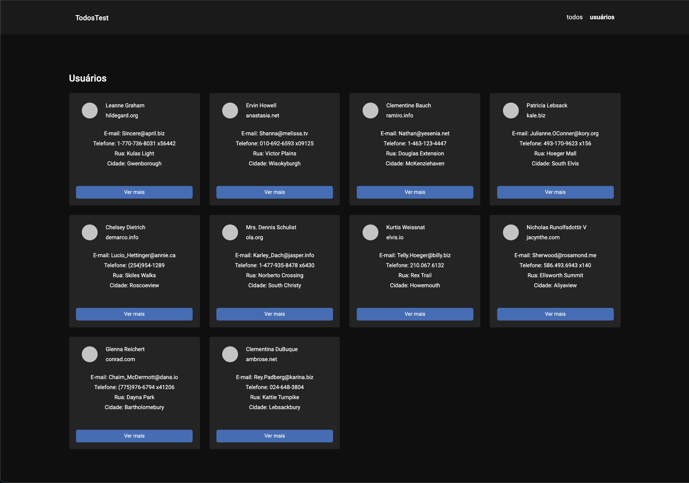
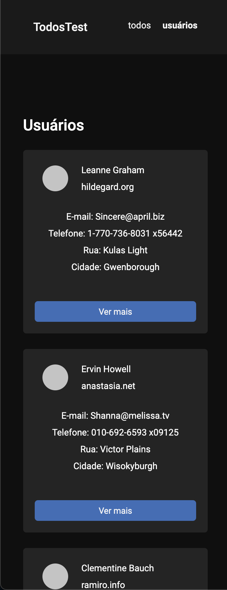
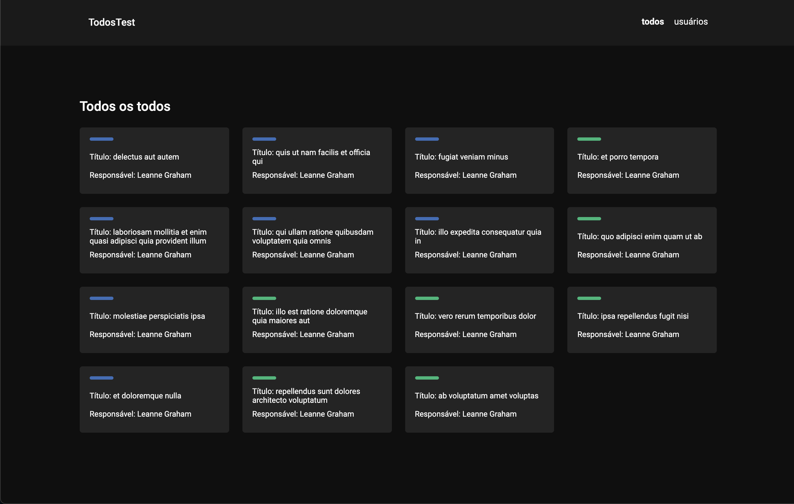
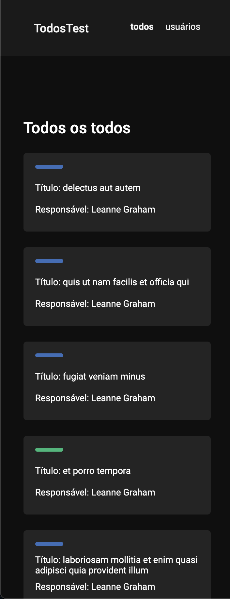

<h1 align="center">TodosTest</h1>

Aplicação frontend React para consumir dados da API JSON Placeholder e exibi-los conforme layout previamente estabelecido

:coffee:

<h2>Considerações técnicas</h2>
A aplicação é estruturada em três componentes, Header, TodoCard e UserCard, duas páginas, Todos e Users, e um hook useTodosUsers. Os dados da API são consumidos pelo hook useTodosUsers via cliente HTTP Axios, organizados e disponibilizados para toda a aplicação por meio da Context API do React. Além disto, foi utilizado o superset TypeScript para tipagem dos dados e a biblioteca Styled Componentes para estilização.

  
<h2>Tecnologias utilizadas</h2>
- React 
- TypeScript 
- Styled Components 
- Axios  

<h2>Imagens</h2>

| Página Usuários | Página Usuários responsiva |
|-------|-------|
|||

| Página Todos | Página Todos responsiva |
|-------|-------|
|||

